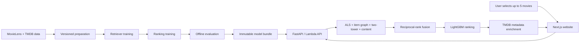

# Movie Recommendation System

An end-to-end movie recommendation platform that learns from historical
movie interactions, retrieves relevant candidates, ranks them with a learned
model, and serves the results through a web application.

## Overview

Users select up to five movies they already like. The system uses those seed
movies to generate a personalized candidate set, combines four retrieval
approaches, applies a LightGBM ranker, enriches the results with TMDB metadata,
and returns recommendation cards to the frontend.

This repository demonstrates the full recommendation lifecycle:

```text
Data → Preparation → Training → Evaluation → Retrieval → Ranking
     → Serving → API → Website → Movie recommendations
```

The online system is seed-based: it does not require a persistent user ID or
account history. Mood labels are currently accepted by the UI/API but are not
yet used by the ranking path.

## What this project does

- Prepares a reproducible, TMDB-keyed MovieLens 32M dataset.
- Trains ALS, item-graph, two-tower, and content retrievers.
- Generates a compact candidate set and fuses retriever ranks.
- Scores candidates with a LightGBM LambdaRank model.
- Packages compatible retrievers, indexes, feature state, and ranker state into
  an immutable model bundle.
- Serves recommendations through FastAPI locally or a Docker-based AWS Lambda
  deployment path.
- Provides a Next.js frontend for movie search, seed selection, and results.

## Architecture



## How it works

### 1. Data preparation

MovieLens ratings and tags are joined to an enriched TMDB catalog. The data
pipeline records source hashes, uses TMDB IDs as operational identifiers, and
creates a per-user chronological train/validation/test split.

[Read the data and feature documentation →](docs/wiki/03-data-and-features.md)

### 2. Model training

Offline training produces four complementary retrievers and a LightGBM
LambdaRank model. Retrieval artifacts include dense indexes or graph neighbors;
the ranker consumes versioned retrieval and popularity features.

[Read the training and model documentation →](docs/wiki/04-training-and-models.md)

### 3. Offline evaluation

Validation compares popularity, rank-only reciprocal-rank fusion, and
LightGBM ranking. The final test partition is protected from iterative model
selection and requires an explicit evaluation command.

[Read the evaluation and experiment documentation →](docs/wiki/06-evaluation-and-experiments.md)

### 4. Candidate retrieval

Each selected seed is sent to ALS, item-graph, two-tower, and content
retrievers. Their outputs are deduplicated and capped before ranking.

[Read the retrieval and ranking documentation →](docs/wiki/05-retrieval-and-ranking.md)

### 5. Ranking

The ranker receives source counts, per-retriever ranks, reciprocal-rank-derived
signals, and candidate popularity features. It orders only the retrieved
candidates; it cannot recover a relevant movie that retrieval omitted.

### 6. Online serving

The validated model bundle is loaded once per process. A request retrieves and
ranks candidates locally, then fetches display metadata from TMDB. Seed movies,
duplicates, and candidates with unavailable metadata are removed from the final
response.

[Read the serving, API, and frontend documentation →](docs/wiki/08-serving-api-frontend.md)

### 7. Website experience

The Next.js frontend searches the catalog, stores the selected seeds, calls the
recommendation endpoint, and renders the returned movie metadata.

## Offline and online flows

| Offline model-building path | Online request path |
|---|---|
| Raw data → preparation → split | User selects seed movies |
| Retriever and ranker training | API receives TMDB seed IDs |
| Validation and model comparison | Four retrievers generate candidates |
| Bundle and index generation | Fusion and LightGBM ranking |
| Artifact/hash validation | TMDB enrichment and JSON response |

## Measured results

The following values are repository-backed validation or local benchmark
results, not online business metrics.

### Ranker validation

| System | NDCG@10 | MAP@10 | MRR@10 |
|---|---:|---:|---:|
| Popularity | 0.179199 | 0.118712 | 0.125135 |
| Reciprocal-rank fusion | 0.276502 | 0.192482 | 0.210940 |
| LightGBM | 0.281976 | 0.195100 | 0.213656 |

### Local warm serving benchmark

| Path | P50 | P95 | P99 |
|---|---:|---:|---:|
| In-process model path | 26.70 ms | 31.88 ms | 34.65 ms |
| HTTP with cached metadata | 32.02 ms | 35.35 ms | 37.38 ms |

The benchmark used 50 requests and five seed movies. Lambda cold-start,
API-Gateway overhead, production throughput, and online engagement are not
currently measured.

[Read the full evaluation and performance evidence →](docs/wiki/06-evaluation-and-experiments.md)

## Technology stack

| Layer | Technology |
|---|---|
| Data and training | Python, pandas, PyArrow, PyTorch, implicit, scikit-learn |
| Retrieval | FAISS, ALS, item graph, two-tower, TF-IDF/content |
| Ranking | LightGBM LambdaRank |
| Backend | FastAPI, Mangum, aiohttp |
| Metadata | TMDB API |
| Frontend | Next.js, React, TypeScript |
| Deployment | Docker, Amazon ECR, AWS Lambda, API Gateway, SAM |

## Quick start

Install the locked Python/frontend dependencies and verify the MovieLens source
dataset:

```bash
./start.sh
```

Start the backend locally with an existing model bundle:

```bash
MODEL_BUNDLE_DIR="$PWD/backend/model_bundle/<bundle-id>" \
PYTHONPATH=backend uv run --frozen python -m uvicorn main:app \
  --host 0.0.0.0 --port 8080
```

Start the frontend in a second terminal:

```bash
npm run dev --prefix frontend
```

Set `NEXT_PUBLIC_API_BASE=http://localhost:8080` for the frontend when a
different API base is required. `./start.sh` prepares dependencies and source
data; it does not train models, create bundles, or start services.

For bundle creation, deployment, troubleshooting, and reproducibility, see
the [reproducibility and roadmap guide](docs/wiki/10-reproducibility-roadmap.md)
and [deployment guide](docs/wiki/09-deployment-reliability.md).

## Documentation

| Topic | Guide |
|---|---|
| Project orientation | [Project overview](docs/wiki/01-project-overview.md) |
| End-to-end architecture | [System architecture](docs/wiki/02-system-architecture.md) |
| Data and features | [Data and feature engineering](docs/wiki/03-data-and-features.md) |
| Training and models | [Training and model architecture](docs/wiki/04-training-and-models.md) |
| Retrieval and ranking | [Retrieval, fusion, and ranking](docs/wiki/05-retrieval-and-ranking.md) |
| Evaluation | [Evaluation and experiments](docs/wiki/06-evaluation-and-experiments.md) |
| Compression and artifacts | [Compression and artifact management](docs/wiki/07-compression-and-artifacts.md) |
| Serving and website | [Serving, API, and frontend integration](docs/wiki/08-serving-api-frontend.md) |
| Deployment and reliability | [Deployment, reliability, and monitoring](docs/wiki/09-deployment-reliability.md) |
| Reproducibility and roadmap | [Reproducibility and roadmap](docs/wiki/10-reproducibility-roadmap.md) |

The [Wiki home page](docs/wiki/Home.md) is the best starting point for the
complete technical documentation set.

## Compact repository map

```text
backend/data_pipeline/   Versioned preparation, splitting, and ranking data
backend/training/        Offline retriever and ranker training
backend/evaluation/      Metrics, baselines, and compression experiments
backend/serving/         Bundle loading, retrieval fusion, and inference
backend/api/             FastAPI routes and request/response schemas
backend/infrastructure/  TMDB and external-service adapters
frontend/                Next.js user experience
docs/wiki/               Deep technical documentation
```

## Testing and quality checks

Run the Python test suite and static checks with the locked environment:

```bash
uv run --frozen pytest
uv run --frozen ruff check backend
```

Serving smoke tests and benchmark commands are documented in the
[serving guide](docs/wiki/08-serving-api-frontend.md).

## License

See [LICENSE](LICENSE).
