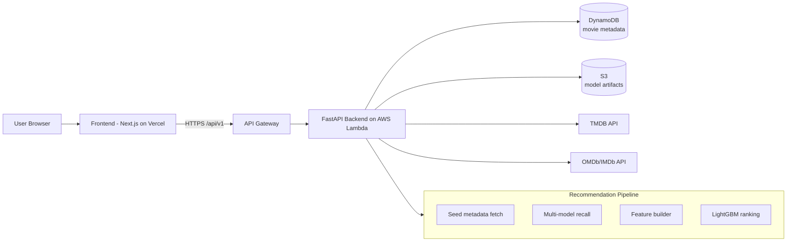

# Movie Recommendation System

This project is a full-stack movie discovery product.

Users pick a few movies they already like, and the system returns personalized recommendations by combining retrieval models, feature engineering, and a ranking model. The app is designed to feel like a real consumer product, not just an ML notebook demo.

## What the project does

- Solves a real user problem: "What should I watch next based on my taste?"
- Lets users curate 5 seed movies, optionally choose mood/genre hints, and get ranked recommendations.
- Blends offline-trained ML artifacts with online API enrichment and production deployment.
- Exposes a clean frontend (Next.js) and backend API (FastAPI on AWS Lambda).

## How recommendations are generated

At runtime, the backend executes a pipeline:

1. Fetch metadata for the user's seed movies.
2. Recall candidate movies from multiple retrieval models.
3. Fetch candidate metadata from storage.
4. Build pairwise/query-level features on the fly.
5. Rank candidates with LightGBM.
6. Return top N enriched movies to the frontend.

In simple terms: retrieval finds many potentially relevant movies quickly, then ranking chooses the best ones for the final list.

## Architecture diagram

## Directory walkthrough (root, backend, frontend)

### Root folder

- `README.md`: high-level project explanation.
- `template.yaml`: AWS SAM infrastructure template (API Gateway + Lambda deployment).
- `docker-compose.yml`: local multi-service orchestration.
- `environment.yml`: Python environment spec for reproducible setup.
- `.github/workflows/deploy.yml`: CI/CD workflow for backend image build and SAM deploy.
- `backend/`: all API, ML inference, data pipelines, and deployment code for server side.
- `frontend/`: user-facing web application.

### Backend folder (`backend/`)

Backend responsibility: serve recommendation and movie APIs with production-safe lifecycle and model loading.

- `main.py`: FastAPI app entrypoint, CORS middleware, router registration, Lambda handler.
- `api/v1/`: REST endpoints.
  - `catalog.py`: trending/popular/new catalog APIs.
  - `movies.py`: movie search and movie detail APIs.
  - `recommend.py`: recommendation generation endpoint and click logging endpoint.
- `common/`: shared runtime services.
  - `lifecycle.py`: lazy initialization for MovieStore and RecommendationPipeline.
  - `services/movie_store.py`: metadata access + TMDB/IMDb fallbacks.
  - `storage/repositories.py`: DynamoDB and S3 artifact repository access.
- `pipeline/pipeline.py`: end-to-end recommendation orchestration (recall -> features -> rank).
- `retrieval/`: candidate generation logic (ALS, two-tower, TF-IDF, content-based, recall service).
- `ranking/`: ranking inference logic (LightGBM ranker).
- `features/`: runtime feature construction for ranking.
- `configs/`: environment and system configuration (paths, buckets, service limits).
- `training/` and `scripts/`: offline data prep, model training, and utility jobs.
- `Dockerfile.lambda`: production container image build for Lambda.

### Frontend folder (`frontend/`)

Frontend responsibility: provide a polished movie discovery UI and call backend APIs safely.

- `src/app/`: route pages (App Router).
  - `/`: home page with hero and catalog rows.
  - `/setup`: seed movie selection and mood setup.
  - `/recommendations`: personalized recommendation results.
  - `/catalog`: browse full category lists.
  - `/about`: project story page.
- `src/features/`: feature-driven modules.
  - `features/movies/`: catalog/search/detail UI and API hooks.
  - `features/recommendations/`: selection state, recommendation requests, result rendering.
- `src/shared/`: shared UI components, API client, env config, layout, utilities.
- `next.config.ts`, `vercel.json`: production build/runtime settings.
- `proxy.ts`: security headers and CSP policy wiring.

## Runtime request flow

1. Frontend calls backend using `NEXT_PUBLIC_API_BASE`.
2. Backend receives request on `/api/v1/...`.
3. Lazy lifecycle initializes store/pipeline when first needed.
4. Pipeline fetches candidates, builds features, ranks results.
5. Response is returned and rendered in UI.

## Deployment snapshot

- Frontend: Vercel.
- Backend: FastAPI packaged as Docker image, deployed to AWS Lambda through SAM.
- API edge: API Gateway.
- Metadata store: DynamoDB.
- Model/data artifacts: S3.

## Simple explanation

This is a movie discovery app that learns from a small set of movies a person already likes. Instead of showing random popular titles, it combines multiple recommendation methods to find good candidates, then ranks them for the final personalized list. The frontend is built to feel like a real product, and the backend is deployed in production on AWS with a scalable API setup.
