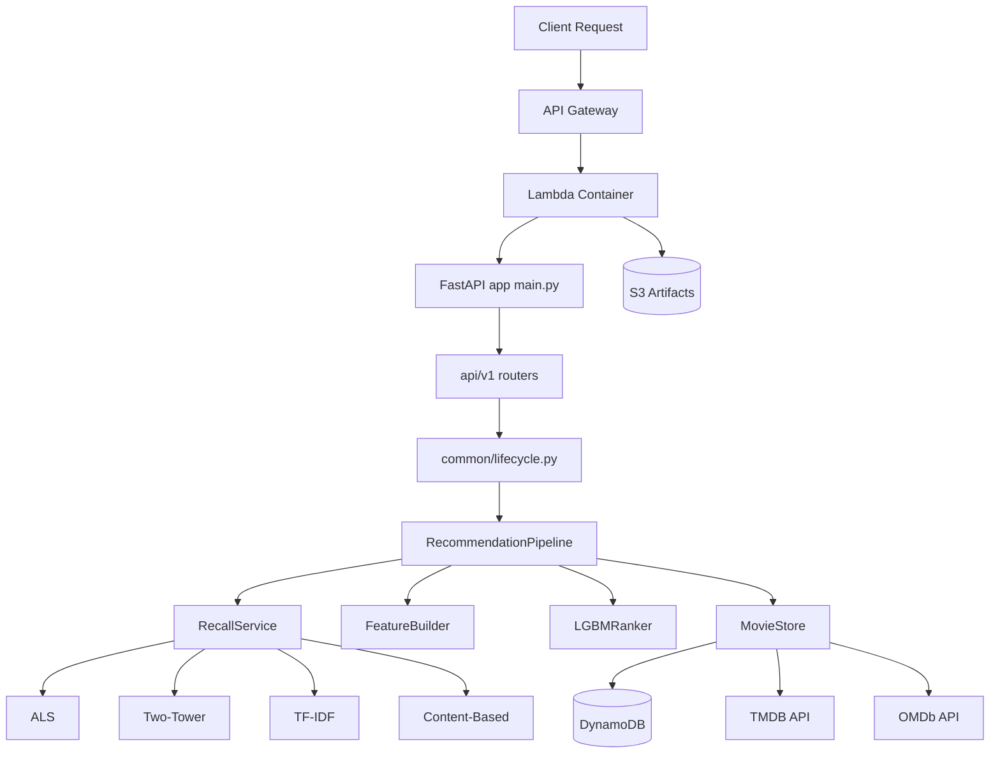

# Backend: Movie Recommendation Service

This backend is the inference and data service layer for the Movie Recommendation System.

It exposes production APIs for movie search, catalog browsing, and personalized recommendations. Under the hood, it runs a multi-stage recommendation pipeline (retrieval + ranking), integrates with DynamoDB/S3, and can run locally or on AWS Lambda.

## What this backend is responsible for

- Serving REST APIs used by the frontend.
- Building recommendations in real time from user-selected seed movies.
- Loading and using trained ML artifacts for retrieval and ranking.
- Fetching movie metadata from DynamoDB with external TMDB/IMDb fallbacks.
- Logging recommendation traces/metrics for observability.

## Runtime architecture

The app is built with FastAPI and organized in layered modules:

- `main.py`: app entrypoint, middleware, router mounting, Lambda adapter (`Mangum`).
- `api/v1/`: HTTP controllers (catalog, movies, recommend).
- `common/`: configuration, lifecycle, storage repositories, external clients.
- `pipeline/`: orchestration of the recommendation flow.
- `retrieval/`: candidate generation models/services.
- `features/`: feature engineering for ranking.
- `ranking/`: final scoring with LightGBM.

Core design pattern: controllers are thin; business flow stays in services/pipeline classes.

## Backend architecture diagram



## Recommendation pipeline (online inference)

Implemented in `pipeline/pipeline.py`:

1. **Seed metadata fetch**
   - Loads metadata for user-selected seed movie IDs via `MovieStore`.
2. **Candidate recall**
   - `RecallService` pulls a broad candidate set from multiple retrieval models.
3. **Candidate enrichment**
   - Batch-loads candidate metadata from DynamoDB and filters invalid entries.
4. **Feature building**
   - `FeatureBuilder` computes runtime ranking features from seed/candidate pairs.
5. **Ranking**
   - `LGBMRanker` scores candidates and returns top results.
6. **Response shaping**
   - Enriched metadata + score + retrieval source trace returned to API response.

This pattern gives both speed (fast recall) and quality (accurate re-ranking).

## Algorithms used in this project

### Retrieval (high recall stage)

Located in `retrieval/models/` and orchestrated by `retrieval/inference/recall.py`:

- **Two-Tower model** (`two_tower.py`)
  - Learns user/item representations for semantic nearest-neighbor retrieval.
- **ALS / Matrix Factorization** (`als.py`)
  - Collaborative filtering from interaction structure.
- **TF-IDF retrieval** (`tfidf.py`)
  - Sparse text/statistical signal retrieval.
- **Content-based retrieval** (`content_based.py`)
  - Similarity from content features/embeddings.
- **ANN index support (FAISS)**
  - Fast nearest-neighbor lookup for embedding retrieval.

### Ranking (precision stage)

- **LightGBM Ranker** (`ranking/inference/lgbm.py`)
  - Combines engineered features and retrieval outputs to rank final candidates.

### Feature engineering

- `features/builder.py`
  - Builds online inference features from seed set and candidate metadata.

## API surface

Main routers under `api/v1/`:

- `GET /api/v1/catalog/trending`
- `GET /api/v1/catalog/popular`
- `GET /api/v1/catalog/new`
- `GET /api/v1/movies/search?q=...`
- `GET /api/v1/movies/{movie_id}`
- `GET /api/v1/movies/tmdb/{tmdb_id}`
- `POST /api/v1/recommend`
- `POST /api/v1/recommend/click`
- `GET /ping` (health-ish)

## Data and integrations

- **DynamoDB**: primary online movie metadata source.
- **S3**: model artifacts and data artifacts.
- **TMDB API**: live metadata fallback for movies not present locally.
- **OMDb/IMDb API**: secondary fallback for posters/overview metadata.

`MovieStore` (`common/services/movie_store.py`) coordinates local lookup + fallback strategy.

## Hosting and deployment

Production backend deployment is AWS-native:

- **Compute**: AWS Lambda (container image).
- **Gateway**: API Gateway (SAM-managed).
- **Packaging**: `backend/Dockerfile.lambda`.
- **Infrastructure**: `template.yaml` (AWS SAM template).
- **CI/CD**: `.github/workflows/deploy.yml`.
  - Builds Docker image.
  - Pushes to ECR.
  - Deploys stack with `sam deploy`.

In Lambda, `Mangum` bridges API Gateway events to FastAPI.

## Request lifecycle (what happens on each recommendation call)

1. Frontend calls `POST /api/v1/recommend` with selected movie IDs.
2. FastAPI router validates payload and forwards to pipeline.
3. `RecallService` retrieves a broad candidate pool from multiple models.
4. `FeatureBuilder` creates ranking features for candidate scoring.
5. `LGBMRanker` scores and sorts candidates.
6. `MovieStore` enriches response with metadata.
7. Backend returns top N recommended movies.

## Configuration model

- Central settings: `configs/settings.py`.
- System-level paths/registry: `configs/system.yml`.
- Key runtime env vars include:
  - `ENVIRONMENT`
  - `ALLOWED_ORIGINS`
  - `S3_ARTIFACT_BUCKET`
  - `DYNAMODB_TABLE_NAME`
  - `TMDB_ACCESS_TOKEN`
  - `IMDB_API_KEY`

## Local development

From the repository root:

```bash
uv sync --frozen
PYTHONPATH=backend uv run --frozen uvicorn main:app --reload
```

Default local API target is typically `http://localhost:8000`.

`uv` manages the repository's Python dependencies from the root `pyproject.toml`
and `uv.lock`; native C++ training libraries are intentionally not included in this
environment setup.

## Folder map (backend)

- `api/`: request/response layer.
- `common/`: shared utilities, config, repositories, clients, lifecycle.
- `configs/`: environment + system configuration.
- `features/`: feature engineering code.
- `pipeline/`: orchestration logic for recommendation flow.
- `retrieval/`: retrieval models and inference-time recall logic.
- `ranking/`: ranker loading and scoring.
- `training/`: offline training pipelines.
- `scripts/`: data/model utility scripts.
- `logger/` and `tracking/`: observability and experiment logging.

## Simple explanation

The backend acts like the app's recommendation brain. It receives a few movies the user likes, quickly gathers many possible matches using several ML approaches, then uses a ranking model to pick the best final results. It is hosted on AWS Lambda behind API Gateway, reads movie metadata from DynamoDB, and loads model artifacts from S3.
