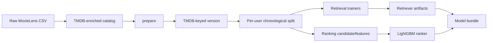
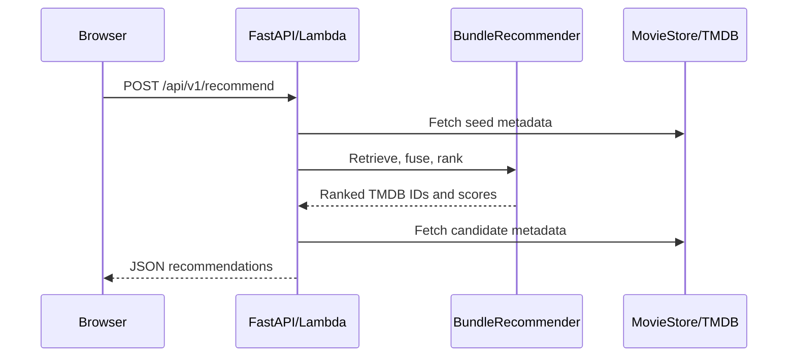

# System Architecture

## Offline path

## Online path

## Runtime construction

`backend/application/lifecycle.py` creates one process-local `BundleRecommendationPipeline`. It loads the bundle once, then reuses the model and metadata client across warm requests. `MODEL_BUNDLE_DIR` is required for recommendation serving.

## Request-time stages

1. Deduplicate positive seed TMDB IDs.
2. Fetch seed metadata.
3. Run ALS, item graph, two-tower, and content retrieval for each seed.
4. Exclude seeds and deduplicate candidate IDs.
5. Apply reciprocal-rank fusion with rank constant `60` and candidate cap `300`.
6. Build the versioned 11-column ranking feature matrix.
7. Run LightGBM inference.
8. Fetch display metadata.
9. Remove missing metadata and return up to the requested count.

## Boundaries

Core retrieval, fusion, ranking features, and metrics do not require FastAPI or AWS. TMDB access is isolated under `infrastructure/`. Training is not invoked during an online request.

## Invariants

- Seeds are never returned.
- Candidate IDs are unique before final output.
- FAISS positions resolve through stored TMDB-ID mappings.
- Feature order must match the ranker artifact schema.
- Bundle components share a dataset and schema contract.
- A failed optional metadata lookup removes that record rather than failing the entire batch.
