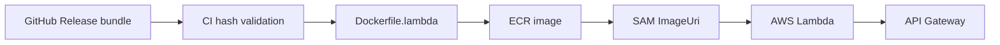

# Deployment, Reliability, and Monitoring

## Deployment path

The Lambda image embeds the production bundle. Lambda does not download models from S3 at request time. ECR is therefore part of the configured deployment path.

## Configured runtime

- Lambda package type: Docker image.
- Architecture: `x86_64`.
- Memory: `2048 MB`.
- Timeout: `60 seconds`.
- Handler: `main.handler` through Mangum.
- Bundle path: `/var/task/model_bundle`.

These are deployment configuration values, not evidence that the live function has been deployed successfully.

## Measured local serving benchmark

The latest recorded 50-request benchmark used five seeds and five warmups:

| Measurement | P50 | P95 | P99 |
|---|---:|---:|---:|
| In-process model path | 26.70 ms | 31.88 ms | 34.65 ms |
| HTTP with cached metadata | 32.02 ms | 35.35 ms | 37.38 ms |

Bundle load time was 498.28 ms. This benchmark is local and warm; it excludes Lambda cold-start and real API Gateway/TMDB network conditions.

## Failure modes

| Failure | Current behavior |
|---|---|
| Missing bundle path | Recommendation request fails; startup only loads when configured |
| Invalid bundle | Bundle loader rejects it before serving |
| Invalid seed ID | Pydantic validation rejects it |
| Unknown metadata | Candidate is omitted |
| TMDB transient error | Retry policy applies; exhausted item lookups are omitted |
| Empty candidate set | Pipeline returns an empty recommendation list |
| Ranker failure | Request returns an error; no fallback ranker is currently wired |
| Duplicate seed/candidate | Removed before final response |

## Current monitoring

Structured request and lifecycle logging exists. The repository does not yet contain production dashboards, alert thresholds, recommendation-quality monitoring, drift detection, cache hit-rate tracking, or online engagement telemetry.

## Recommended gates

Before production promotion, verify bundle hashes, run the complete test suite, build the Lambda image, invoke `/ping`, run the five-seed recommendation smoke test, and run a real Lambda/API Gateway latency benchmark.
