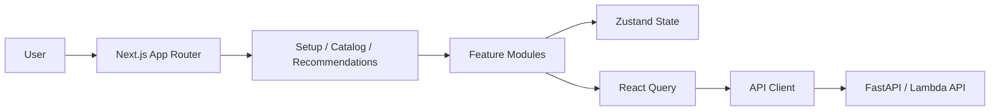

# Frontend: Movie Discovery Experience

The frontend is a Next.js 16 and TypeScript application for selecting movie
seeds and displaying recommendations returned by the backend API.

The current user flow is:

1. Browse or search the catalog.
2. Select up to five seed movies.
3. Request recommendations from `POST /api/v1/recommend`.
4. Display the ranked response on `/recommendations`.

The backend uses the selected TMDB IDs as recommendation seeds. The current
recommendation button sends an empty `moods` list; the persisted genre state is
not currently included in the API payload.

## Frontend architecture

The app uses the Next.js App Router and a feature-first source layout:

- `src/app/`: route-level pages and layout boundaries.
- `src/features/movies/`: catalog, search, movie details, and movie UI.
- `src/features/recommendations/`: seed selection, recommendation requests,
  result rendering, and persisted selection state.
- `src/shared/api/`: the central API client.
- `src/shared/config/`: environment and site configuration.
- `src/shared/ui/`: reusable presentation components.

State and network responsibilities are separate:

- Zustand persists selected movies and recommendation results in the browser.
- React Query manages recommendation and catalog request state.
- Client components handle interactive setup and recommendation actions.



## Routes

| Route | Purpose |
| --- | --- |
| `/` | Landing page and catalog highlights |
| `/setup` | Select five seed movies |
| `/recommendations` | Render ranked recommendations and details |
| `/catalog` | Browse trending, popular, and new movies |
| `/about` | Project context and product explanation |

## Backend integration

The API base URL is configured with `NEXT_PUBLIC_API_BASE` and defaults to the
local backend port:

```env
NEXT_PUBLIC_API_BASE=http://localhost:8080
```

Recommendation requests currently follow this shape:

```json
{
  "seed_tmdb_ids": [603, 238, 680, 550, 13],
  "moods": [],
  "limit": 20
}
```

The API client prefixes feature paths with `/api/v1`. See the
[serving and API documentation](../docs/wiki/08-serving-api-frontend.md) for
the complete request and response contract.

## Runtime hardening

- `src/shared/config/env.ts` validates public environment variables with Zod.
- `src/proxy.ts` configures security headers and derives `connect-src` from the
  configured API origin.
- Loading, empty, and error states are implemented for interactive flows.

The repository contains Vercel deployment configuration. Production frontend
behavior depends on setting `NEXT_PUBLIC_API_BASE` to the deployed backend URL.

## Local development

From the repository root:

```bash
npm ci --prefix frontend
npm run dev --prefix frontend
```

The backend must be running separately on port `8080` unless
`NEXT_PUBLIC_API_BASE` is changed.

## Scripts

- `npm run dev`: start the development server.
- `npm run build`: create a production build.
- `npm run start`: serve the production build.
- `npm run lint`: run ESLint.
- `npm run test`: run Jest tests.
- `npm run analyze`: build with bundle analysis enabled.

For the complete system flow, see the [project Wiki](../docs/wiki/Home.md).
