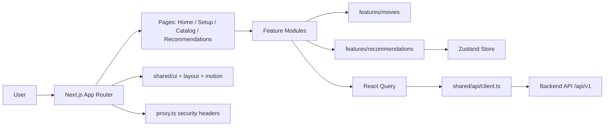

# Frontend: Movie Discovery Experience

This frontend is the user-facing product for the Movie Recommendation System.

It is built with Next.js 16 and TypeScript, and it guides users through a curation flow: select seed movies, optionally refine by mood/genre, then view ranked recommendations generated by the backend ML pipeline.

## Product goal

- Provide a polished, portfolio-grade cinematic discovery experience.
- Make recommendation quality visible through UX, not just model metrics.
- Keep interactions fast and resilient even if backend connectivity is unstable.

## Frontend architecture

The app follows a feature-first structure:

- `src/app/`: route-level pages (App Router).
- `src/features/`: business features (`movies`, `recommendations`).
- `src/shared/`: reusable UI, config, API client, providers, utilities.

State and data responsibilities are clearly split:

- **Zustand** (`features/recommendations/store.ts`): selected movies, selected genres, recommendation results, error state.
- **React Query**: network requests, caching, loading states.
- **Server components**: used for catalog-like pages where appropriate.
- **Client components**: used for interactive curation flow and modals.

## Frontend architecture diagram



## Main user flow

1. User opens `/setup`.
2. User selects up to 5 seed movies via autocomplete.
3. User can optionally choose mood/genre signals.
4. Frontend sends payload to `POST /api/v1/recommend`.
5. Results are stored and rendered on `/recommendations`.
6. User can refresh recommendations using the same seeds.

## Routes and what they do

- `/` (`src/app/page.tsx`)
  - Home landing page with hero and curated rows.
- `/setup` (`src/app/setup/page.tsx`)
  - Interactive recommendation setup workflow.
- `/recommendations` (`src/app/recommendations/page.tsx`)
  - Displays final ranked results and detail modal.
- `/catalog` (`src/app/catalog/page.tsx`)
  - Expanded browse view for trending/popular/new categories.
- `/about` (`src/app/about/page.tsx`)
  - Narrative page describing project intent.

## API integration model

- Central API client: `src/shared/api/client.ts`.
- Base URL from env: `NEXT_PUBLIC_API_BASE`.
- Request path convention: `${NEXT_PUBLIC_API_BASE}/api/v1/...`.
- Runtime response validation support via Zod schema (optional).
- Graceful fallback behavior to avoid hard crashes when backend is unreachable.

Movie and recommendation calls are feature-local:

- `features/movies/api/catalog.ts` for catalog endpoints.
- `features/movies/api/movies.ts` for search/detail requests.
- `features/recommendations/api/recommendations.ts` for recommendation generation.

## UI system and UX choices

- Typography and motion handled in `layout.tsx` and shared motion components.
- Reusable UI primitives under `src/shared/ui/`.
- Persistent selection state allows users to navigate without losing choices.
- Empty/error states are explicitly designed, not just default error text.

## Security and runtime hardening

- `src/proxy.ts` sets security headers (CSP, HSTS, X-Frame-Options, etc.).
- CSP `connect-src` is wired to the API origin via `NEXT_PUBLIC_API_BASE`.
- Environment validation in `src/shared/config/env.ts` with Zod.

## Hosting and deployment

- Hosted on **Vercel**.
- Production behavior configured via `vercel.json` and `next.config.ts`.
- The frontend depends on deployed backend API Gateway URL from env.

## Page flow (what users experience)

1. Home page introduces catalog highlights.
2. Setup page collects seed movies and optional mood filters.
3. App requests recommendations from backend.
4. Recommendations page presents ranked results with detail modal.
5. Catalog page supports wider browsing by category.

## Local development

From `frontend/`:

```bash
npm install
npm run dev
```

Required env in `.env.local`:

```env
NEXT_PUBLIC_API_BASE=http://localhost:8000
```

Optional app URL metadata env (if needed):

```env
NEXT_PUBLIC_APP_URL=http://localhost:3000
```

## Scripts

- `npm run dev`: start development server.
- `npm run build`: production build.
- `npm run start`: run built app.
- `npm run lint`: run ESLint.
- `npm run test`: run Jest tests.
- `npm run analyze`: build with bundle analyzer.

## Folder map (frontend)

- `src/app/`: page routes, root layout, loading/error boundaries.
- `src/features/movies/`: catalog rows/grids, movie APIs, movie detail hooks/components.
- `src/features/recommendations/`: recommendation flow, setup widgets, result components, store.
- `src/shared/api/`: centralized API client.
- `src/shared/config/`: env + site config.
- `src/shared/ui/`: shared components (buttons, layout, motion wrappers, etc.).

## Simple explanation

The frontend is the part users interact with. It helps people choose a few favorite movies, sends that preference to the backend, and shows personalized recommendations in a clean and responsive interface. It is hosted on Vercel and communicates with the AWS-hosted backend through secure API calls.
